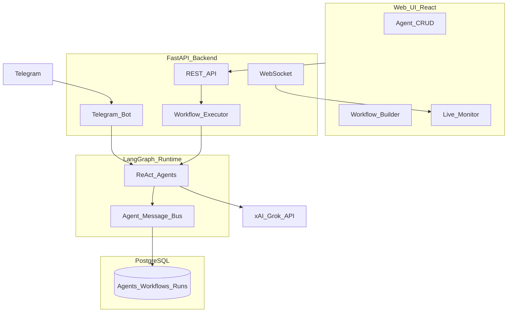

# Yuno Agent Orchestration Platform

AI Agent Orchestration Platform for the **Yuno AI Engineer Challenge** — create agents, configure behavior, connect them in collaborative workflows, and interact via Telegram. (The Demo video you can find in demos folder)

## Architecture



### Layer separation

| Layer | Technology | Responsibility |
|-------|------------|----------------|
| UI | React + Vite + React Flow | Agent CRUD, workflow canvas, live monitor |
| API | FastAPI | REST, WebSocket, validation |
| Runtime | LangGraph `create_react_agent` | Tool execution, multi-step reasoning |
| LLM | xAI Grok (OpenAI-compatible) | `https://api.x.ai/v1` |
| Persistence | PostgreSQL / SQLite | Agents, workflows, runs, messages, tokens, notes |
| Channel | python-telegram-bot | Human ↔ gateway agent |

### Why LangGraph?

- **State & checkpoints**: workflow runs can be extended with persisted graph state
- **Control**: explicit executor + message bus vs opaque CrewAI crews
- **ReAct**: proven tool-calling loop matching production patterns
- Compared to **CrewAI**: better for custom async handoffs; compared to **AutoGen**: simpler ops for this scope

### Configurable dimensions per agent (10+)

1. Name  
2. Role  
3. System prompt  
4. Model (`grok-4.1-fast`, `grok-4.3`)  
5. Tools (calculator, web_search, note_store)  
6. Channels (Telegram on/off)  
7. Schedule (cron, timezone, enabled)  
8. Memory (window, summary)  
9. Skills (tags)  
10. Interaction rules  
11. Guardrails (max iterations, blocked topics)  
12. Gateway flag (Telegram default agent)

## Quick start (single local setup command)

```bash
docker compose --env-file .env.example up --build
```

This runs fully local with mock LLM (`MOCK_LLM=1` in `.env.example`), so no API key is required for evaluation.

## Evaluation mode (no API keys required)

For assessment review, you can run and test the platform **without sharing any secrets**.

- Do **not** commit or share `.env`
- Use `.env.example` only
- Keep `MOCK_LLM=1` for local evaluation
- Telegram integration is optional unless a reviewer provides their own token

Run exactly:

```bash
docker compose --env-file .env.example up --build
```

Then verify:

- Web UI: `http://localhost:3000`
- API docs: `http://localhost:8000/docs`
- Health: `http://localhost:8000/health`
- Backend tests:
  ```bash
  docker compose run --rm -e PYTHONPATH=/app api pytest -v
  ```

What works in evaluation mode:

- Agent CRUD
- Workflow builder and execution
- Real-time monitoring events
- Inter-agent message persistence
- Token usage/cost tracking (mock values)

What needs reviewer-provided keys:

- Real LLM calls (Grok/Groq) with `MOCK_LLM=0`
- Live Telegram bot interaction (`TELEGRAM_BOT_TOKEN`)

- **Web UI**: http://localhost:3000  
- **API**: http://localhost:8000  
- **API docs**: http://localhost:8000/docs  

### Local dev (without Docker)

**Backend:**
```bash
cd backend
pip install -r requirements.txt
cp ../.env.example ../.env
# .env.example already has MOCK_LLM=1 for no-key local run
# For real provider testing set MOCK_LLM=0 and XAI_API_KEY/GROQ_API_KEY
uvicorn app.main:app --reload --port 8000
```

**Frontend:**
```bash
cd frontend
npm install
npm run dev
```

Open http://localhost:5173

## LLM API setup (Grok **or** Groq)

The app **auto-detects** your provider from the API key prefix:

| Key prefix | Provider | Base URL | Default model |
|------------|----------|----------|---------------|
| `gsk_` | **Groq** (free tier) | `api.groq.com` | `llama-3.3-70b-versatile` |
| `xai-` | **xAI Grok** | `api.x.ai` | `grok-3-mini` |

**Groq (free, recommended if you have `gsk_` key):**
```env
XAI_API_KEY=gsk_your_groq_key   # or GROQ_API_KEY=
LLM_PROVIDER=groq
GROQ_MODEL=llama-3.3-70b-versatile
MOCK_LLM=0
```

**xAI Grok:**
```env
XAI_API_KEY=xai-your-key
LLM_PROVIDER=xai
XAI_MODEL=grok-3-mini
MOCK_LLM=0
```

Verify (use Python 3.11 from project root):
```bash
py -3.11 scripts/test_grok.py
```

**Note:** Grok (xAI) and Groq are different companies — do not send a `gsk_` key to `api.x.ai`.

## Telegram setup

1. Message [@BotFather](https://t.me/BotFather) → `/newbot` → copy token  
2. Add to `.env`:
   ```
   TELEGRAM_BOT_TOKEN=your-token
   ```
3. Restart API. Mark one agent as **Telegram gateway** in the UI.  
4. Commands:
   - `/start` — help  
   - `/agents` — list agents  
   - `/run research What are AI agents?` — run workflow  
   - Any text — chat with gateway agent  

## Pre-built workflow templates

| Template | Flow |
|----------|------|
| **Research → Writer** | Researcher (web_search) → async message → Writer (summary) |
| **Support Triage** | Triage (classify) → condition (`contains:urgent`) → SupportResponder |

## Demo script (record video)

1. `docker compose up --build` — all services healthy  
2. Open http://localhost:3000 — show seeded agents  
3. **Workflows** → select "Research → Writer" → enter query → **Run**  
4. **Monitor** → show live events, inter-agent messages, token usage  
5. Telegram → send message to bot → show reply  
6. **Agents** → edit an agent (tools, guardrails) → save  

See [demos/DEMO_SCRIPT.md](demos/DEMO_SCRIPT.md) for a full checklist.

## Adding a workflow template

1. Create agents in the UI (or API)  
2. Build workflow in **Workflows** canvas (agent / condition / end nodes)  
3. Save via **Save** button  
4. Or POST `/api/workflows` with `is_template: true` and a `definition` JSON:

```json
{
  "nodes": [
    {"id": "n1", "type": "agent", "position": {"x": 0, "y": 0}, "data": {"agentId": "<uuid>", "label": "Step1"}},
    {"id": "n2", "type": "end", "position": {"x": 300, "y": 0}, "data": {"label": "End"}}
  ],
  "edges": [{"id": "e1", "source": "n1", "target": "n2"}]
}
```

## Adding a messaging channel

1. Create `backend/app/channels/<name>_bot.py`  
2. Wire inbound messages to `run_agent()` or `WorkflowExecutor`  
3. Register start/stop in `app/main.py` lifespan  
4. Add channel config to Agent `channels` JSON in UI  

## Tests

```bash
cd backend
# Use Python 3.11+ (3.14 may lack prebuilt wheels on Windows)
py -3.11 -m pip install -r requirements.txt
set MOCK_LLM=1
py -3.11 -m pytest -v
```

Or inside Docker: `docker compose run --rm -e PYTHONPATH=/app api pytest -v`

## Project structure

```
yuno-agent-platform/
├── backend/app/          # FastAPI, models, runtime, telegram
├── frontend/src/         # React UI
├── scripts/test_grok.py  # Grok API smoke test
├── demos/                # Demo checklist
└── docker-compose.yml    # postgres + api + web
```

## HR assessment gaps addressed (post-feedback)

See [docs/HR_FEEDBACK_ADDRESSED.md](docs/HR_FEEDBACK_ADDRESSED.md) for scheduler, guardrails, memory window, and cyclic workflow fixes.

## Security

See [docs/SECURITY.md](docs/SECURITY.md) — `.env` gitignored, guardrails enforced, key rotation guidance.

## License

MIT — built for Yuno AI Engineer hiring challenge.
